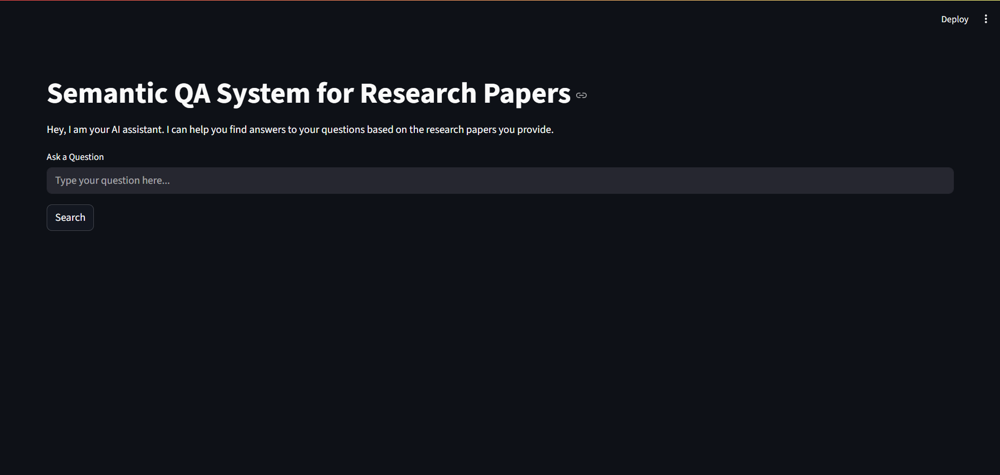
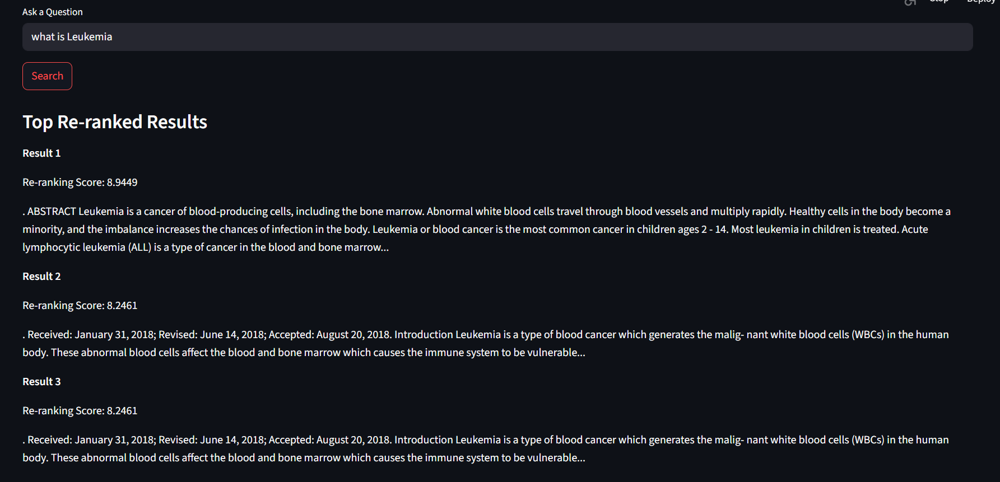
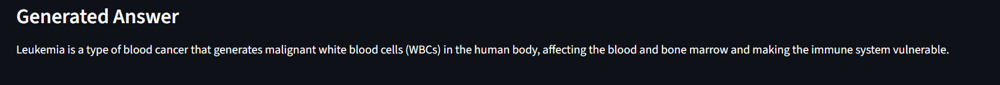
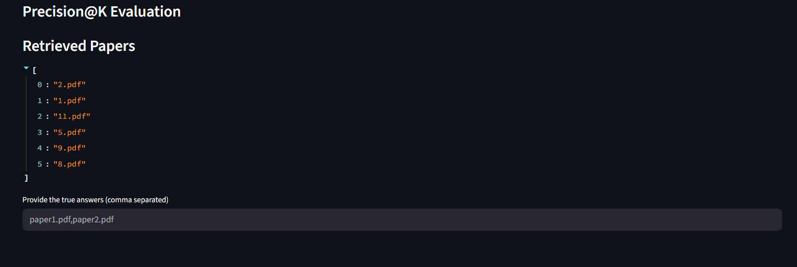

# Semantic Search & Intelligent Q&A System

A Retrieval-Augmented Generation (RAG) based application that enables semantic search and intelligent question answering over a collection of research papers.

The system uses Sentence Transformer embeddings, ChromaDB vector search, CrossEncoder re-ranking, and the Llama 3.2 model (via Ollama) to retrieve relevant information and generate accurate answers.

---

## Features

- PDF document ingestion
- Automatic text preprocessing
- Intelligent text chunking
- Sentence Transformer embeddings
- ChromaDB vector database
- Semantic search using embeddings
- CrossEncoder re-ranking
- Llama 3.2 powered Question Answering
- Streamlit Web Interface
- Precision@K Evaluation

---

## Technology Stack

| Technology | Purpose |
|------------|---------|
| Python | Programming Language |
| Streamlit | Web Interface |
| PyMuPDF | PDF Text Extraction |
| Sentence Transformers | Text Embeddings |
| ChromaDB | Vector Database |
| CrossEncoder | Re-ranking |
| Ollama | Local LLM Inference |
| Llama 3.2 | Question Answering |

---

## Project Structure

```
Semantic_QA_System/

│── app.py
│── build_database.py
│── search.py
│── evaluate.py
│── config.py
│── requirements.txt
│── README.md
│
├── data
│   ├── raw
│   └── chroma_db
│
├── src
│   ├── ingest.py
│   ├── preprocess.py
│   ├── chunker.py
│   ├── embeddings.py
│   ├── vector_store.py
│   ├── reranker.py
│   └── llm.py
│
└── screenshots
```

---

## System Architecture

```
Research Papers

        │

        ▼

Document Ingestion

        │

        ▼

Text Preprocessing

        │

        ▼

Chunking

        │

        ▼

Sentence Transformer Embeddings

        │

        ▼

ChromaDB Vector Database

        │

        ▼

Semantic Search

        │

        ▼

CrossEncoder Re-ranking

        │

        ▼

Llama 3.2 (Ollama)

        │

        ▼

Generated Answer
```

---

## Installation

### Clone the Repository

```bash
git clone https://github.com/Jeevan-003/Semantic_QA_System.git

cd Semantic_QA_System
```

---

### Create Virtual Environment

Windows

```bash
python -m venv myenv

myenv\Scripts\activate
```

---

### Install Dependencies

```bash
pip install -r requirements.txt
```

---

### Install Ollama

Download Ollama

https://ollama.com/download

Pull the model

```bash
ollama pull llama3.2
```

---

## Preparing the Dataset

Place all research papers inside

```
data/raw/
```

---

## Build the Vector Database

```bash
python build_database.py
```

---

## Run the Application

```bash
streamlit run app.py
```

---

## Example Questions

- What is Acute Lymphoblastic Leukemia?
- Which dataset was used?
- What are the traditional challenges faced

---

## Evaluation

The system includes Precision@K evaluation.

Precision@K is calculated as

```
Precision@K = Relevant Retrieved Documents / Total Retrieved Documents
```

The evaluation compares retrieved research papers against manually identified relevant papers.

---

## Sample Output Screenshots

### Home page




### Reranking Results after Semantic Search



### Generated Answer



### Precision@K Evaluation



### Precision@K Evaluation Results


## Future Improvements

- Support for DOCX and TXT documents
- Incremental indexing
- Hybrid Search
- Metadata filtering
- Multi-document collections
- GPU acceleration

---

## Author

Jeevan J.R.

